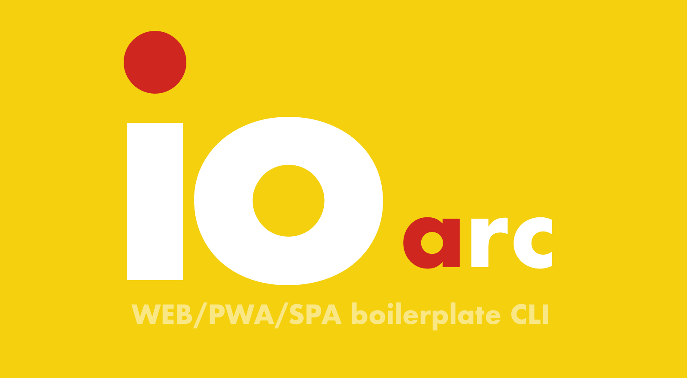

# io arc

It's so easy! build in 5 minutes! web boilerplate CLI.

<div align="center"></div>

## Install

```shell script
$ npm i -g @io-arc/cli
# or
$ yarn global add @io-arc/cli
```

## Usage

```shell script
$ cd <Project Directory>
$ io-arc
```

## Select language and frameworks

### HTML template engine

- HTML (with handlebars)
- Pug

The global constants that are available: [HTML (with handlebars)](./tasks/task-webpack-html#features), [Pug](./tasks/task-webpack-pug#features)

### CSS language

- CSS
- SASS(SASS/SCSS)
- Stylus

### JS preprocessor

- Babel
- TypeScript

#### JS framework

Automatically available in selected preprocessors.

- Vue (Babel/TypeScript)

## Local Server

- [BrowserSync](https://browsersync.io/)

## Other default use

- File copy
- YAML to JSON file build
- Build directory clean
- Stats for library used
- Create manifest.json
- Create service-worker (Use [WorkBox](https://developers.google.com/web/tools/workbox/modules/workbox-build))

### How to create manifest.json

Put manifest.yml or manifest\*\*.yml(e.g. manifest-ios.yml) directly under the workspace.  
If the file name is prefix with '\_'(e.g. `_manifest.yml`), it is not applicable.

Reference See: [@io-arc/task-manifest](./tasks/task-manifest#specification)

### How to create service-worker file

Execute `src/sw.js` if it exists.  
It is created using `generateSW` of [WorkBox](https://developers.google.com/web/tools/workbox/modules/workbox-build).

Reference See: [@io-arc/task-service-worker](./tasks/task-service-worker#usage)

## Directory structure

Create directory structure below.

```text
<Project Directory>
    ├ config/ (settings)
    │   ├ default.yml (site settings)
    │   ├ development.yml
    │   ├ production.yml
    │   ├ local.yml (build settings)
    │   ├ local-development.yml
    │   └ local-production.yml
    ├ src/ (working directory)
    │   ├ css/
    │   ├ html/
    │   ├ img/ (using file-loader)
    │   ├ js/
    │   ├ static/ (file copy)
    │   └ yaml2json/
    ├ types/ (select TypeScript only)
    ├ .babelrc (select Babel only)
    ├ .browserslistrc
    ├ .editorconfig
    ├ .eslintrc.yml
    ├ .gitignore
    ├ .npmrc
    ├ .prettierrc
    ├ tsconfig.json (select TypeScript only)
    ├ package.json
    └ webpack.config.json
```

## Build options

Internally, the build can be tweaked using the [node-config](https://www.npmjs.com/package/node-config) library.

### Site settings

Settings related to the website, such as the site title, are specified in the `default.yml` or `development.yml` or `production.yml`.  
See example for [default.yml](./packages/env/config/default.yml).

### Build settings

The build configuration is be done in `local.yml`.  
See example for [local.yml](./packages/env/config/local.yml).
